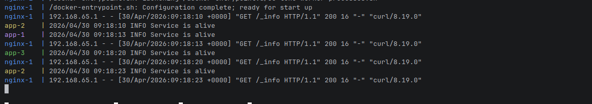

# LoadBalancer
 - Create CRUD API Golang application for room booking
 - Create PostgreSQL database
 - Create Docker Compose files for application and Database
 - Create Tests for Application
 - Configure the Nginx as Reverse proxy and load balancer
 - Create CI/CD pipeline using GitHub actions for running tests
## Quick Start
```
docker compose up --build --scale app=3
```
The `--scale app=<number of pods>` decides amount of pods for booking services that will be started
## Testing
Open another terminal and run
```
curl http://localhost/_info
```
This endpoint checks availability of service and prints message, in logs you will see that you get responses from different pods.
You should see something similar to this
